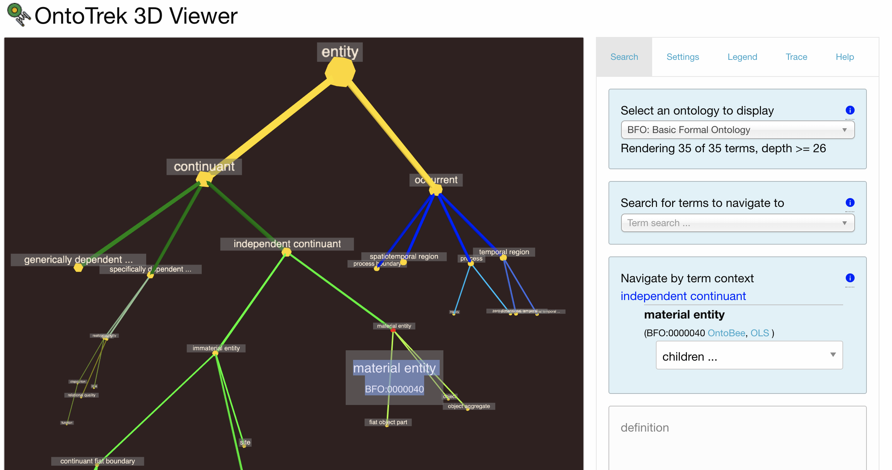
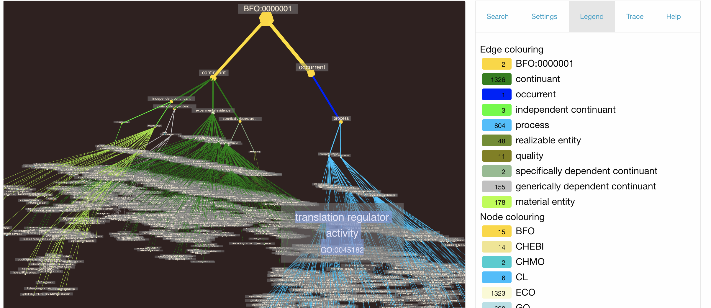

OntoTrek is an ontology terminology viewer that takes advantage of 3d graph rendering software. Currently it displays all classes and subclasses but no axioms. We have a variety of ontologies to choose from, mainly from OBOFoundry.org, but we also provide a python script below for getting OntoTrek to display other ontologies, as described below.  OntoTrek color codes terms by their ontology prefix, or by branches of an upper level ontology they conform to, so that one can visually see which ontologies are at play. It is designed to illustrate the interplay of domain specific ontologies involved in an application ontology.

See it in action at **[http://genepio.org/ontotrek](http://genepio.org/ontotrek)**.

OntoTrek is under development at Hsiao Labs which is associated with the University of British Columbia Department of Pathology and Laboratory Medicine, and with the PHSA Public Health Laboratory at the British Columbia Centre For Disease Control. Contact [Damion Dooley](mailto:damion.dooley@bccdc.ca) for more information on this project.

## Running this on your computer

OntoTrek can be run immediately in your browser if you have cloned the github repo to your computer.  Since the index.html app page script fetches the selected ontology file in .json format from the data/ subfolder, it requires running a local webserver from the folder it is located in, e.g. 
    
> python -m http.server

This enables one to open a web browser, usually with URL http://localhost:8000/index.html to run the application.

If you want to look at a particular ontology file that is not in the list, currently you need to do two things:

1) Run the ontofetch.py program (downloadable from https://github.com/Public-Health-Bioinformatics/ontofetch) on a local .owl file in rdf/xml format, (or a remote URL of the same format) to produce a simplified .json version of your ontology, like so:

> python ontofetch.py http://purl.obolibrary.org/obo/bfo/2.0/bfo.owl -o data -r http://purl.obolibrary.org/obo/BFO_0000001

This produces a .json representation of your OWL rdf/xml format file.  By default all terms that are explicit owl:subClass of owl:Thing are retrieved.  If you want to retrieve another root term (or more than one particular branch), use the "-r" parameter and include a comma-separated list of term URL's.  

*(If ontofetch.py reports that it is "Doing terms: 0" or "Doing terms: 1", instead of your full ontology, this may be because the children of your root term are not explicitly owl:subClassOf the root, but rather are stated as children via an equivalency statement.  Try turning reasoner on, run it, and save inferred class relations to a new owl file and run ontofetch.py on that.)*

For any selected term, OntoTrek displays a label, definition and synonyms annotated as rdfs:label, IAO definition, and gene ontology oboInOwl#hasSynonym etc. Soon other popular description and synonym annotations will be added.

2) adjust the index.html &lt;select id="ontology"&gt; menu of ontology files to include your desired ontology.  Then browse to the webpage.

We'll try to eliminate these steps in the future by allowing a URL of an ontology to be entered directly in the web app.

## Building this from scratch

This application for the mostpart relies only on javascript in your browser.  However, it loads the 3d-force-graph script which is contained inside bundle.js.  If for development reasons you want to upgrade bundle.js to the latest versions of 3d-force-graph etc. you will need to install the node.js npm environment.  Details of javascript and file generation are in /js/common.js. To summarise:

To update 3d-force-graph etc. run this in OntoTrek root folder:
  
  > npm update 

To update /js/bundle.js which needs latest 3d-force-graph, need to run 
  browserify.org's "browserify" command. To load it (may need sudo su):

  > npm install -g browserify
  > npm install uniq 

Then in /js folder, regenerate bundle.js based on super-basic index.js

  > browserify index.js -o bundle.js

That should do it!
